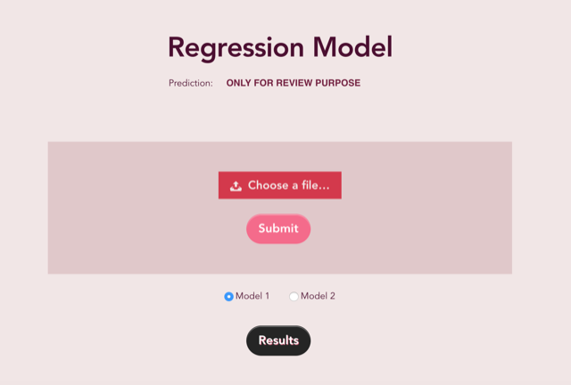
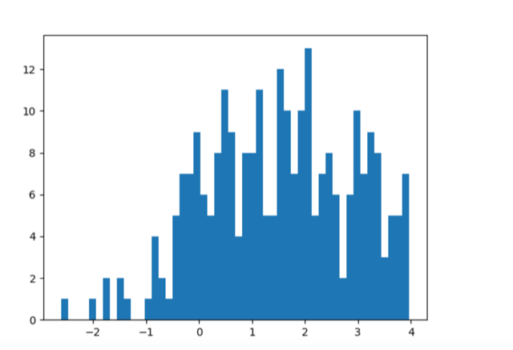
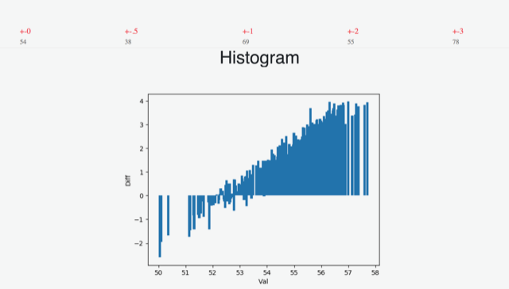
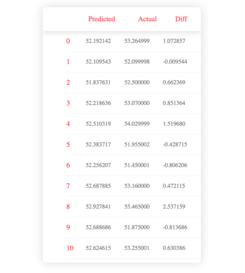

# Flask Tensorflow Regression WebAP

This is a deployable webapp but on its backend its a scalable regression model which can be trained on your own dataset. 
By simply changing the number of paramaters and implementing the training functions on the backend you will get a 
webapp which could be tested on any dataset.


---

## Set up the development environment
To setup the complete web app following steps are used -
1. Install python,tensorflow and all the libraries mentioned in the files
2. Install all the python dependencies. 
3. Or Install anaconda virtual env which will manage most of the dependencies
4. GPU based tensorflow would be appreciated.
---

## Overview
The webapp is divided into 3 Main Categories which includes Model Creation,Linking Model With Server,Testing the model.
This can been implemented using `own_model.py`,`views.py`,`./Template` resepectively. Finally after the linkage and training
of the model you will finally end up with testable webapp
File Structure:


## Training
The model can be trained using the `own_model.py` file which contains the main function. The main function will go through
a feed forward layer which is defined as mentioned below
```py
	z1 = tf.matmul(x,w1) + b1

	a1 = tf.nn.tanh(z1)
	# a1 = tf.nn.dropout(a1,0.7)
	
	z2 = tf.matmul(a1,w2) + b2
	a2 = tf.nn.elu(z2,name='a2')
	a2 = tf.nn.dropout(a2,0.7)

	z3 = tf.matmul(a2,w3) + b3
	a3 = tf.nn.elu(z3,name='a3')
	a3 = tf.nn.dropout(a3,0.7)

	z4 = tf.matmul(a3,w4) + b4
	a4 = tf.nn.elu(z4,name='a4')
```
The current implementation contains a 4 layer feed forward loop. With dropout layers in between in order to not overfit the model. You can compare the test and train accuracy and  accordingly increase the probablity of the dropout function.
You can also use regularization which is commented out in the code

```py
	reg_losses = tf.get_collection(tf.GraphKeys.REGULARIZATION_LOSSES)
	reg_constant = 0.01  # Choose an appropriate one.
	loss = tf.add(loss,reg_constant * tf.reduce_sum(reg_losses))
  
```
Inorder to train a new model, make changes in the getData function and thus the data will get returned batch wise.
```py
	d = pd.read_csv('filename.csv',dtype=np.float64)
```
You also need to intialize parameters on the first layer with the number of parameters you are passing in the csv, similarly 
for the output
```py
w1 = tf.get_variable("w1",[PARAM_INT,14],dtype=tf.float32,initializer= tf.contrib.layers.xavier_initializer())
```
For further training the pretrained model you can use the ``MainContinue()`` with the right reference to the saved model.
```py
new_restore = tf.train.import_meta_graph('abu_dhabi/abu_model-20000.meta')
```

## Testing
The selection model completely depends upon the testing results. So once the model is trained we have created a `mainEvaluate()` function which would help you in comparing the test and train results. Depending upon the difference
you can make change in feedforward.
```py
	d = np.array(ans) - np.array(test_Y)
	number = d.shape[0]
	d  = tuple(d.reshape(number))
	plt.bar(y,d,width=0.09,align='center')

```
Evaluate the model using a bar graph of Matplotlib







***
## Server
The biggest challenge with the server was to get the results while testing with the least latency. The computation for the server is happening in `app/views.py`.Since we have feedforward multipiication happening at the run time. And since there are multiple models to be loaded while testing we have to load all
of them at the start of the server rather than dynamically
```py
with sess.as_default():
	with model1_graph.as_default():
		global loss,a2,xP,yP,scale,sess
		new_restore = tf.train.import_meta_graph('newAbu/abu_model-25000.meta')
		new_restore.restore(sess,tf.train.latest_checkpoint('./newAbu/'))	
		graph = tf.get_default_graph()
		scale = pickle.load(open('normAbuNewScaler.p','rb'))
		xP = graph.get_tensor_by_name("x:0")
		yP = graph.get_tensor_by_name("y:0")
		a2 = graph.get_tensor_by_name("a4:0")
		loss = tf.losses.mean_squared_error(yP,a2)
```
Finally in the REST POST callback function we have to do all the computation to send back the results.

```py
@app.route('/open', methods = [ 'POST'])
def sendOutput():
		if option == 'model1':
			with sess.as_default():
				test_X,test_Y = own_model.getEvaluateData(scale)
				cost,ans = sess.run([loss,a2],feed_dict={xP:test_X,yP:test_Y})
```
Finally the rendered html with td tags will be sent to the frontend.

## FrontEnd
We will be using Html Css and Javascript for the frontend.We have used JQuery since it is fast, small, and feature-rich JavaScript library.
It makes things like HTML document traversal and manipulation, event handling, animation, and Ajax much simpler
with an easy-to-use API that works across a multitude of browsers.Finlly, Ajax will make the query request Asynchronous
and thus improve the latency of the application.

The user will upload the file using Ajax post request , which will be computed, rendered and sent back to frontend
to display the results along with Histogram and Bargraph for visualization. With additional matrix representing the difference



***
